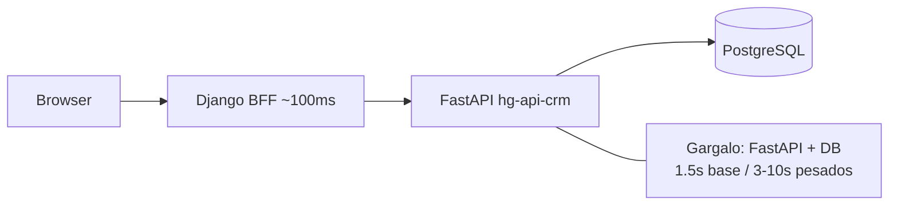

# Relatório de latência — API CRM FastAPI (`hg-api-crm`)

Relatório consolidado para o time Arancia e repasse ao time FastAPI. Baseado em medições de **18/Jun/2026** documentadas em [crm-api-performance-metrics.md](crm-api-performance-metrics.md), logs de sessão recente (detalhe task, dashboard) e inventário do BFF Django em `crm_api/services/`.

**Documentos relacionados:**

- [Métricas detalhadas e metodologia](crm-api-performance-metrics.md) — ambiente, comandos de probe, headers de instrumentação
- [Prompt de migração de permissões para o repositório FastAPI](fastapi-permissions-migration-prompt.md) — auth interna Bearer, remoção de permission checks, fases e riscos

---

## Conclusão executiva



| Achado | Valor | Implicação |
|--------|-------|------------|
| Overhead Django BFF | **~100 ms** | Não é o gargalo |
| Latência base uniforme | **~1,5–1,8 s** em quase todo GET autenticado | Forte indício de **middleware de auth/permissões** + pool/query |
| Endpoints pesados | **3–10 s** | Queries/joins sem índice ou N+1 |
| Fan-out Kanban | **~10 calls** (~14,5 s sequencial) | Multiplicador sobre latência base |

**Conclusão:** o tempo dominante está na API CRM (`http://192.168.0.214/hg-api-crm/api/v1`), não no Django BFF. A latência ~1,6 s **uniforme** em endpoints simples sugere custo fixo por request (Basic Auth + API key + resolução de permissões), não apenas SQL lento.

---

## Ranking por latência (pior → melhor)

| Tier | Endpoint | Latência observada | Onde aparece | Hipótese principal |
|------|----------|-------------------|--------------|-------------------|
| **P0 crítico** | `GET /billing/summary` | **9.943 ms** (1ª visita); ~1.600 ms depois | Faturamento | Agregação pesada + cold start |
| **P0 crítico** | `GET /tasks/my/?limit=50` | **4.741–4.867 ms** | Dashboard (antes), Minhas Tasks | N+1 assignees/status |
| **P0 crítico** | `GET /tasks/{id}/links` | **~7.704 ms** | Detalhe task (tab) | Join + auth repetido |
| **P0 crítico** | `GET /tasks/{id}/move-history` | **~7.712 ms** | Detalhe task (tab) | Histórico sem índice |
| **P0 crítico** | `GET /tasks/{id}/attachments` | **~6.214 ms** | Detalhe task (tab) | Listagem + storage metadata |
| **P0 crítico** | `GET /tasks/{id}/subtasks` | **~6.186 ms** | Detalhe task (tab) | Subtasks N+1 |
| **P1 alto** | `GET /alerts/` | **3.139–3.214 ms** | Dashboard (antes), Alertas | Join contrato + cliente |
| **P1 alto** | `GET /boards/` | **~1.793 ms** | Kanban (resolver board) | List + auth |
| **P2 base** | `GET /lookups/crm` | **~1.616–1.627 ms** | Kanban, forms, task detail | Lookup + auth; duplicado no mesmo request |
| **P2 base** | `GET /lookups/gais` | **~1.551 ms** | Kanban, forms | Idem |
| **P2 base** | `GET /me/context` | **~1.583–1.686 ms** | Menu CRM (context processor) | Permissões + boards acessíveis |
| **P2 base** | `GET /boards/{id}` | **~1.590 ms** | Kanban | Board detail |
| **P2 base** | `GET /boards/{id}/columns` | **~1.595 ms** | Kanban | Colunas |
| **P2 base** | `GET /tasks/?board_id=&limit=100` | **~1.601 ms** | Kanban | Lista cards |
| **P2 base** | `GET /boards/{id}/access/me` | **~1.538 ms** | Kanban, detalhe task | Check de permissão board |
| **P2 base** | `GET /billing/` | **~1.600 ms** | Faturamento | Listagem |
| **P2 base** | `GET /clients/` | **~1.663 ms** | Clientes | Listagem |
| **P2 base** | `GET /tasks/{id}` | ~1.5–7 s (varia) | Detalhe task, ajax tabs | Task + embeds |
| **OK** | `GET /lookups/users` | **6 ms (404)** | Kanban | Endpoint inexistente — BFF faz fallback caro |
| **OK** | `GET /health` | (probe) | Diagnóstico | Sem auth |

Medições P0 de detalhe task vêm de logs de sessão recente; demais valores confirmados em [crm-api-performance-metrics.md §4](crm-api-performance-metrics.md#4-latência-por-endpoint--medições-confirmadas).

---

## Fan-out por tela (impacto acumulado)

| Tela | Calls CRM típicas | Tempo total estimado | Status BFF |
|------|-------------------|----------------------|------------|
| **Kanban comercial** | ~10 calls (lookups duplicados + board + columns + tasks + access + me/context) | **~14,5 s** sequencial | Paralelo parcial (3 workers) em columns/tasks/access |
| **Detalhe task (F5, antes do lazy load)** | get_task + assignees + watchers + lookups + 5 tabs | **~30+ s** potencial | Lazy load já reduzido no JS |
| **Faturamento** | summary + billing/ + me/context | **~3–12 s** | summary na 1ª visita pior |
| **Dashboard** | ~~3 calls~~ → **0 calls** | instantâneo | Já simplificado para hub de atalhos |

### Kanban comercial — sequência típica

1. `GET /boards/` (resolver board `crm_comercial`)
2. `GET /lookups/crm`
3. `GET /lookups/gais`
4. `GET /lookups/users` → **404**
5. `GET /lookups/crm` *(duplicado no mesmo request)*
6. `GET /boards/{id}`
7. `GET /boards/{id}/columns`
8. `GET /tasks/?board_id={id}&limit=100`
9. `GET /boards/{id}/access/me`
10. `GET /me/context`

Colunas + tasks + access rodam em **paralelo** (3 workers) após o board carregar; lookups e board detail continuam sequenciais.

### Detalhe task — calls potenciais

| Momento | Endpoints |
|---------|-----------|
| SSR inicial | `GET /tasks/{id}`, `GET /boards/{id}/access/me`, lookups |
| Tabs lazy (AJAX) | `/subtasks`, `/links`, `/attachments`, `/move-history`, `/comments` |
| Sidebar | `/assignees`, `/watchers` |

Com lazy load, tabs pesadas (~6–7 s cada) só disparam ao abrir a aba; F5 com todas as tabs ainda representa risco de **30+ s** acumulados.

---

## Inventário completo de endpoints consumidos pelo BFF

Mapeados em `crm_api/services/*.py`. O browser **nunca** chama a FastAPI diretamente — apenas o Django BFF.

### Tasks (`crm_api/services/tasks.py`)

| Método | Endpoint |
|--------|----------|
| GET | `/tasks/`, `/tasks/my/` |
| GET/POST/PATCH/DELETE | `/tasks/{id}` |
| PATCH | `/tasks/{id}/move` |
| GET | `/tasks/{id}/move-history` |
| GET/POST | `/tasks/{id}/subtasks` |
| GET/POST/DELETE | `/tasks/{id}/links`, `/tasks/{id}/links/{link_id}` |
| GET/POST/PATCH/DELETE | `/tasks/{id}/assignees`, `/tasks/{id}/assignees/{assignee_id}` |
| GET/POST/DELETE | `/tasks/{id}/watchers`, `/tasks/{id}/watchers/{watcher_id}` |
| POST | `/tasks/{id}/watch`, `/tasks/{id}/comments` |
| GET/POST/DELETE | `/tasks/{id}/attachments`, `/tasks/{id}/attachments/{attachment_id}` |

### Boards (`crm_api/services/boards.py`)

| Método | Endpoint |
|--------|----------|
| GET/POST/PATCH/DELETE | `/boards/`, `/boards/{id}` |
| GET/POST/PATCH | `/boards/{id}/columns`, `/boards/{id}/columns/{column_id}` |
| PATCH | `/boards/{id}/columns/reorder` |
| GET/POST/PATCH/DELETE | `/boards/{id}/access`, `/boards/{id}/access/{access_id}` |
| GET | `/boards/{id}/access/me` |

### Lookups (`crm_api/services/lookups.py`)

| Endpoint |
|----------|
| `/lookups/crm`, `/lookups/gais`, `/lookups/users`, `/lookups/designations` |
| `/lookups/groups`, `/lookups/column-templates`, `/lookups/team-gais` |

### Auth / contexto (`crm_api/services/auth.py`)

| Método | Endpoint |
|--------|----------|
| GET | `/me/context` |
| POST | `/auth/validate-context` |

### Negócio

| Serviço | Endpoints |
|---------|-----------|
| `clients.py` | `/clients/`, `/clients/{gai_id}`, contatos/endereços |
| `contracts.py` | `/contracts/`, `/contracts/{id}`, `/contracts/{id}/files` |
| `billing.py` | `/billing/`, `/billing/{id}`, `/billing/summary` |
| `alerts.py` | `/alerts/`, `/alerts/fire/{id}` |
| `projects.py` | `/projects/`, `/projects/{id}`, members, `/projects/{id}/tasks` |
| `recurrences.py` | `/task-recurrences/`, runs, scheduler interno |
| `settings.py` | `/service-types`, `/prioritys`, `/status-tasks` (+ reorder) |

### Interno (sem auth de usuário)

| Método | Endpoint | Auth |
|--------|----------|------|
| POST | `/internal/scheduler/generate-due-tasks` | `Bearer CRM_INTERNAL_API_SECRET` via `build_scheduler_headers()` |

Referência: [`crm_api/context.py`](../crm_api/context.py) — scheduler já usa Bearer interno; ver [prompt de migração](fastapi-permissions-migration-prompt.md) para estender a todas as calls do BFF.

---

## Metas de SLA propostas (repasse FastAPI)

| Endpoint | Hoje | Meta | Notas |
|----------|------|------|-------|
| Lookups (`/lookups/*`) | ~1,6 s | **< 100 ms** | Cache TTL 5 min |
| `/me/context`, `/boards/{id}/access/me` | ~1,5 s | **eliminar ou < 50 ms** | Se virar responsabilidade Django |
| `/tasks/my/` | ~4,8 s | **< 500 ms** | |
| `/tasks/{id}/*` sub-recursos | ~6–7 s | **< 300 ms** | tabs detalhe task |
| `/alerts/` | ~3,2 s | **< 500 ms** | |
| `/billing/summary` | ~1,6–9,9 s | **< 500 ms** | |
| GET simples (catálogo) | ~1,6 s | **< 500 ms** | Threshold do comando `measure_crm_api_latency` |

### Impacto no usuário final

| Tela | TTFB hoje (estimado) | Meta após otimização |
|------|----------------------|----------------------|
| CRM Dashboard | instantâneo (hub) / ~5–7 s (legado) | **< 2 s** se widgets voltarem |
| Kanban comercial | ~14–15 s | **< 3 s** |
| Faturamento | ~3–12 s | **< 2 s** |
| Detalhe task (lazy) | ~2–8 s por tab | **< 1 s** por tab |
| Lookups (cache hit) | ~1,6 s/call | **< 100 ms** |

---

## Hipóteses de causa raiz

### Latência uniforme ~1,6 s

1. **Middleware de auth** — Basic + API key com query pesada em todo request
2. **Pool SQLAlchemy** — conexão nova por request ou pool esgotado
3. **Proxy nginx → uvicorn** — buffer/timeout/upstream lento
4. **Resolução de permissões** — `permission_codenames`, `accessible_boards` recalculados por call

### Endpoints desproporcionais

| Endpoint | Hipótese |
|----------|----------|
| `/tasks/my/` | N+1 em assignees/status |
| `/tasks/{id}/subtasks`, `/links`, `/attachments`, `/move-history` | Joins + auth repetido por sub-recurso |
| `/alerts/` | Join contrato + cliente sem índice |
| `/billing/summary` | Agregação sem cache; cold start na 1ª visita |
| `/lookups/users` | 404 — BFF tenta fallback caro |

A principal alavanca de latência base está documentada no [prompt de migração de permissões](fastapi-permissions-migration-prompt.md): FastAPI como data layer interna com Bearer secret, permissões no Django BFF.

---

## Como reproduzir medições

Ver metodologia completa em [crm-api-performance-metrics.md §3](crm-api-performance-metrics.md#3-metodologia-utilizada).

```bash
# Latência direta na API (ideal para o time FastAPI)
python manage.py measure_crm_api_latency \
  --username ARC_USER \
  --password SENHA \
  --repeat 5 \
  --board-id {ID}

# Baseline por página Django
python manage.py measure_performance_baseline \
  --username ARC_USER \
  --password SENHA \
  --repeat 3
```

Com `PERFORMANCE_INSTRUMENTATION = True` em `setup/local_settings.py`, cada response Django inclui:

| Header | Significado |
|--------|-------------|
| `X-CRM-HTTP-Calls` | Quantidade de calls à API CRM |
| `X-CRM-HTTP-Time-Ms` | Soma do tempo em calls CRM |
| `X-Request-Time-Ms` | Tempo total do request Django |

Logs por call em `crm_api/client.py`:

```text
CRM API GET http://192.168.0.214/hg-api-crm/api/v1/{endpoint}
CRM API response 200 ... ({elapsed_ms}ms)
```

---

## Referências no repositório Arancia

| Arquivo | Descrição |
|---------|-----------|
| [docs/crm-api-performance-metrics.md](crm-api-performance-metrics.md) | Medições brutas e metodologia |
| [docs/fastapi-permissions-migration-prompt.md](fastapi-permissions-migration-prompt.md) | Prompt para migração no hg-api-crm |
| `logistica/management/commands/measure_crm_api_latency.py` | Probe direto na API |
| `logistica/management/commands/measure_performance_baseline.py` | Baseline por página |
| `crm_api/client.py` | Client HTTP + logs de latência |
| `crm_api/context.py` | Headers Basic e Bearer (scheduler) |
| `crm/views/kanban_helpers.py` | Fan-out Kanban |
| `crm/views/view_dashboard.py` | Dashboard (hub de atalhos) |
| `crm/views/views_tasks/task_tab_helpers.py` | Lazy load tabs detalhe task |
| `.cursor/rules/220-business-crm-auto.mdc` | Arquitetura BFF confirmada |
