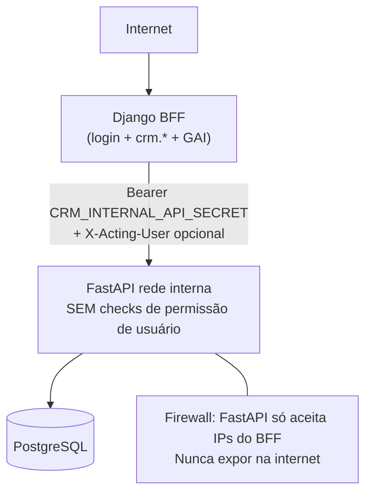

# Prompt — Migração de permissões para auth interna (hg-api-crm)

**Como usar:** copie a seção [Prompt para colar no Cursor](#prompt-para-colar-no-cursor) e cole no repositório FastAPI `hg-api-crm`.

**Documentos relacionados (repositório Arancia):**

- [Relatório de latência CRM](crm-api-latency-report.md) — ranking, fan-out, SLAs
- [Métricas de performance e metodologia](crm-api-performance-metrics.md) — medições 18/Jun/2026, comandos de probe

---

## Contexto resumido

O projeto **Arancia** (Django) é o **único BFF** do CRM. O browser nunca chama a FastAPI diretamente — toda navegação passa por views Django em `/arancia/crm/...` que usam `CrmApiClient` → `http://192.168.0.214/hg-api-crm/api/v1`.

Hoje cada request autenticado leva **~1,5–1,8 s** mesmo em lookups simples. Endpoints pesados chegam a **3–10 s**. Ver [relatório de latência](crm-api-latency-report.md).

---

## Premissa de segurança (obrigatória)

**"Sem permissões de usuário na API" ≠ API pública.**



- FastAPI fica em **rede interna** (`192.168.0.214`), bind apenas em IP interno.
- Firewall: permitir somente IPs do Django BFF, Celery workers e jobs agendados.
- Auth entre BFF e API: **`Authorization: Bearer {CRM_INTERNAL_API_SECRET}`** — mesma ideia do endpoint scheduler já existente.
- `X-Acting-User: {username}` — **somente auditoria/log**, nunca usado para autorização.
- Autorização de negócio (`crm.view_task`, escopo GAI, etc.) permanece **100% no Django**.

Referência no Arancia: `build_scheduler_headers()` em `crm_api/context.py` — **estender esse padrão para todas as calls do BFF**.

---

## Prompt para colar no Cursor

```markdown
# Tarefa: Migrar hg-api-crm para data layer interna (sem permission checks de usuário)

## Contexto

O repositório Arancia (Django BFF) é o único cliente browser-facing do CRM. Fluxo obrigatório:

Browser → Django views (`/arancia/crm/...`) → `CrmApiClient` → FastAPI `/api/v1`

O browser **nunca** chama a FastAPI diretamente. Toda autorização de usuário (login Django, permissões `crm.*`, escopo GAI/UserDesignation) já acontece no BFF antes de chamar a API.

## Problema

Medições em 18/Jun/2026 (repositório Arancia, ver docs/crm-api-latency-report.md):

- Latência base uniforme: **~1,5–1,8 s** em quase todo GET autenticado (lookups, boards, me/context)
- Endpoints pesados: **3–10 s** (`/tasks/my/`, `/billing/summary`, sub-recursos de task)
- Overhead Django BFF: **~100 ms** — não é o gargalo

Hipótese principal: middleware de **Basic Auth + resolução de permissões** executado em **cada** request, somado a pool/query.

Auth atual das calls do BFF:
- `Authorization: Basic {username}:{password}` (usuário logado)
- `X-API-Key: {CRM_API_KEY}`

Exceção existente (já implementada): scheduler interno usa `Authorization: Bearer {CRM_INTERNAL_API_SECRET}` em `POST /internal/scheduler/generate-due-tasks`.

## Objetivo

Transformar a FastAPI em **data layer interna**:

1. Aceitar auth interna Bearer para calls do BFF
2. **Remover** checks de permission codename por endpoint (equivalentes ao seed `crm.*` do Django)
3. **Remover ou deprecar** endpoints usados como gate de autorização (`/me/context`, `/boards/{id}/access/me`)
4. Manter validação de schema, integridade de dados e regras de domínio que não são permissão de usuário

Meta de latência pós-migração (auth middleware):
- Lookups: **< 100 ms** (com cache)
- Auth middleware: **< 10 ms** por request
- `/tasks/my/`: **< 500 ms**
- Sub-recursos `/tasks/{id}/*`: **< 300 ms**

## Restrições de segurança (NÃO negociáveis)

1. API **nunca** exposta na internet pública sem firewall
2. Bind em IP interno apenas
3. Firewall: whitelist IPs Django BFF + Celery
4. Bearer secret rotacionável (`CRM_INTERNAL_API_SECRET`)
5. `X-Acting-User` é audit-only — **proibido** usar para autorização
6. Manter Basic auth legado atrás de feature flag até o BFF migrar 100%

## Inventário de endpoints consumidos pelo BFF Django

Todos em `crm_api/services/` do Arancia. Implementar auth interna Bearer em **todos** os `/api/v1/*` abaixo (exceto `/health` e rotas já internas).

### Tasks
- GET/POST/PATCH/DELETE `/tasks/`, `/tasks/my/`, `/tasks/{id}`
- PATCH `/tasks/{id}/move`
- GET `/tasks/{id}/move-history`
- GET/POST `/tasks/{id}/subtasks`
- GET/POST/DELETE `/tasks/{id}/links`, `/tasks/{id}/links/{link_id}`
- GET/POST/PATCH/DELETE `/tasks/{id}/assignees`, `/tasks/{id}/assignees/{assignee_id}`
- GET/POST/DELETE `/tasks/{id}/watchers`, `/tasks/{id}/watchers/{watcher_id}`
- POST `/tasks/{id}/watch`, `/tasks/{id}/comments`
- GET/POST/DELETE `/tasks/{id}/attachments`, `/tasks/{id}/attachments/{attachment_id}`

### Boards
- GET/POST/PATCH/DELETE `/boards/`, `/boards/{id}`
- GET/POST/PATCH `/boards/{id}/columns`, `/boards/{id}/columns/{column_id}`
- PATCH `/boards/{id}/columns/reorder`
- GET/POST/PATCH/DELETE `/boards/{id}/access`, `/boards/{id}/access/{access_id}`
- GET `/boards/{id}/access/me` ← deprecar como gate; manter read-only informativo se necessário

### Lookups
- GET `/lookups/crm`, `/lookups/gais`, `/lookups/users`, `/lookups/designations`
- GET `/lookups/groups`, `/lookups/column-templates`, `/lookups/team-gais`

### Auth / contexto
- GET `/me/context` ← deprecar campos de autorização ou endpoint inteiro
- POST `/auth/validate-context`

### Negócio
- `/clients/`, `/contracts/`, `/billing/`, `/billing/summary`, `/alerts/`
- `/projects/`, `/task-recurrences/`
- Catálogos: `/service-types`, `/prioritys`, `/status-tasks`

### Já interno
- POST `/internal/scheduler/generate-due-tasks` (Bearer — referência de implementação)

## O que REMOVER na FastAPI

1. Middleware/dependency de Basic Auth + resolução de permissões em rotas `/api/v1/*` chamadas pelo BFF (após flag de migração)
2. Checks de permission codename por endpoint (equivalentes `crm.view_task`, `crm.view_board`, etc.)
3. Uso de `GET /me/context` como fonte de autorização
4. Uso de `GET /boards/{id}/access/me` como gate de autorização

## O que PERMANECE na FastAPI

- Validação Pydantic / schema de payload
- Integridade referencial (FK, constraints)
- Regras de domínio puras (ex.: status válido, move entre colunas)
- Endpoints CRUD como data layer
- `/health` sem auth

## O que o Django BFF já faz (não replicar na API)

- `@login_required` + `logistica.acesso_arancia` + `crm_permission_required`
- Gates em templates: ``
- Codenames em `CrmPermissions` (modelo dummy Django)
- Escopo GAI/UserDesignation (rules 080/201) — BFF filtra antes de chamar API
- Cache Redis de lookups (TTL 5 min) — mitiga, não resolve latência base

## Regras hoje na API que migram para Django

| Regra hoje na API | Onde Django usa | Ação no Django (fase posterior) |
|-------------------|-----------------|-----------------------------------|
| `accessible_boards` / `accessible_projects` | `crm/context_processors.py` via `/me/context` | Listar via API sem filtro de permissão + filtrar no Django por `crm.view_board` e membership |
| `can_comment` / board access | `crm/views/views_tasks/_helpers.py`, `kanban_helpers.py` | Regra Django: `crm.view_task` + board na lista acessível |
| Escopo GAI/cliente | Rules GAI | Continua no Django — API retorna conforme filtros explícitos do BFF |

## Mudança de contrato HTTP (BFF → FastAPI)

**Antes:**
```
Authorization: Basic {user}:{password}
X-API-Key: {CRM_API_KEY}
```

**Depois (calls do BFF):**
```
Authorization: Bearer {CRM_INTERNAL_API_SECRET}
X-Acting-User: {username}   # audit only
X-API-Key: {CRM_API_KEY}    # segunda camada opcional
```

Alteração prevista no Arancia (fora deste repo, após Fase 1):
- Novo `build_bff_headers()` em `crm_api/context.py`
- `CrmApiClient` usa Bearer interno por padrão; Basic só para legado/transição

## Fases de implementação

### Fase 1 — Auth (maior ganho de latência esperado)

- [ ] Criar dependency `verify_internal_bff(request)` — valida `Bearer CRM_INTERNAL_API_SECRET`
- [ ] Rotas `/api/v1/*`: aceitar Bearer interno **OU** Basic legado (feature flag `ALLOW_LEGACY_BASIC_AUTH=true`)
- [ ] Logar tempo do middleware de auth **antes e depois** (structured log com ms)
- [ ] Garantir que `/health` permanece sem auth
- [ ] Documentar env var `CRM_INTERNAL_API_SECRET` (mesmo valor do Arancia)

### Fase 2 — Remover permissões de usuário

- [ ] Remover decorators/checks de permission codename em routers
- [ ] Manter validação de schema/payload
- [ ] `/me/context`: deprecar campos `permission_codenames`; manter só dados se ainda necessário para transição
- [ ] Confirmar que nenhum endpoint filtra por permissão Django — BFF passa filtros explícitos (board_id, client_id, etc.)

### Fase 3 — Endpoints de access

- [ ] `/boards/{id}/access/me`: tornar read-only informativo ou deprecar com sunset date
- [ ] Documentar em README/OpenAPI: "BFF é único gate de autorização"
- [ ] Implementar `GET /lookups/users` (hoje 404 — BFF faz fallback caro)

### Fase 4 — Hardening infra

- [ ] Bind FastAPI apenas em IP interno
- [ ] Firewall: permitir só IPs Django/Celery
- [ ] Rotacionar `CRM_INTERNAL_API_SECRET` (runbook documentado)
- [ ] Remover Basic auth legado quando Arancia confirmar migração 100%

## Critérios de aceite

Reproduzir com comando do Arancia (após BFF migrar headers na fase posterior):

```bash
python manage.py measure_crm_api_latency \
  --username ARC_USER --password SENHA --repeat 5 --board-id {ID}
```

| Métrica | Critério |
|---------|----------|
| Lookups (`/lookups/crm`, `/lookups/gais`) | **< 500 ms** (meta final < 100 ms com cache) |
| Auth middleware (log interno) | **< 10 ms** |
| `/tasks/my/?limit=50` | **< 500 ms** |
| `/tasks/{id}/subtasks`, `/links`, `/attachments`, `/move-history` | **< 300 ms** cada |
| 2ª execução imediata de lookup | Se continua ~1,6 s → problema **não** é cold start |

Headers Django (quando `PERFORMANCE_INSTRUMENTATION=True`): `X-CRM-HTTP-Calls`, `X-CRM-HTTP-Time-Ms`.

## Compatibilidade / rollback

- Feature flag `ALLOW_LEGACY_BASIC_AUTH` default `true` até Arancia migrar
- Bearer e Basic coexistem durante transição
- Nenhuma breaking change no schema JSON dos endpoints
- Deprecation headers (`Deprecation: true`, `Sunset: ...`) em `/me/context` e `/boards/{id}/access/me` se mantidos temporariamente

## Riscos e mitigações

| Risco | Mitigação |
|-------|-----------|
| API exposta na LAN sem auth de usuário | Firewall + Bearer + bind interno |
| BFF bug expõe dados de outro cliente | Django mantém filtros GAI/UserDesignation antes de chamar API |
| Celery/jobs perdem contexto de usuário | Jobs usam service user explícito ou `X-Acting-User` header (audit) |
| Regressão de `can_comment` no Kanban | Teste manual Kanban + detalhe task pós-migração no Arancia |
| Latência persiste após remover auth | Investigar pool SQLAlchemy, índices, nginx → uvicorn (ver relatório latência) |

## Entregáveis esperados

1. PR com Fase 1 implementada + logs de before/after do auth middleware
2. OpenAPI atualizado documentando auth Bearer interno
3. README com env vars, firewall e runbook de rotação de secret
4. Lista de endpoints com permission checks removidos (Fase 2)
5. Evidência de `measure_crm_api_latency` ou curl equivalente mostrando redução de latência base

## Referências externas (repositório Arancia)

- Relatório latência: `docs/crm-api-latency-report.md`
- Métricas brutas: `docs/crm-api-performance-metrics.md`
- Client HTTP: `crm_api/client.py`
- Headers auth: `crm_api/context.py` (`build_crm_headers`, `build_scheduler_headers`)
- Probe: `logistica/management/commands/measure_crm_api_latency.py`
```

---

## Mudança de contrato HTTP (detalhe)

| Header | Antes | Depois |
|--------|-------|--------|
| `Authorization` | `Basic {user}:{password}` | `Bearer {CRM_INTERNAL_API_SECRET}` |
| `X-Acting-User` | — | `{username}` (audit only) |
| `X-API-Key` | `{CRM_API_KEY}` | Mantido (2ª camada opcional) |

O scheduler interno no Arancia já implementa o padrão Bearer:

```python
# crm_api/context.py
def build_scheduler_headers() -> dict[str, str]:
    secret = getattr(settings, "CRM_INTERNAL_API_SECRET", "") or ""
    return {"Authorization": f"Bearer {secret}"}
```

Follow-up no Arancia (após FastAPI Fase 1): criar `build_bff_headers()` e migrar `CrmApiClient` para Bearer por padrão.

---

## Fases de migração (visão consolidada)

| Fase | Escopo | Ganho esperado |
|------|--------|----------------|
| **1 — Auth** | `verify_internal_bff`, Bearer + Basic legado (flag) | Eliminar ~1,5 s de auth middleware |
| **2 — Permissões** | Remover permission codename checks | Menos queries por request |
| **3 — Access endpoints** | Deprecar `/me/context` e `/access/me` como gates | Menos fan-out no BFF |
| **4 — Hardening** | Firewall, bind interno, rotação secret | Segurança operacional |

---

## Riscos (referência rápida)

| Risco | Mitigação |
|-------|-----------|
| API exposta na LAN sem auth de usuário | Firewall + Bearer + bind interno |
| BFF bug expõe dados de outro cliente | Django mantém filtros GAI/UserDesignation |
| Celery/jobs perdem contexto de usuário | Service user ou `X-Acting-User` (audit) |
| Regressão `can_comment` no Kanban | Teste manual pós-migração |
| Latência persiste | Pool SQL, índices, proxy nginx |

---

## Referências no repositório Arancia

| Arquivo | Descrição |
|---------|-----------|
| [docs/crm-api-latency-report.md](crm-api-latency-report.md) | Ranking, fan-out, SLAs |
| [docs/crm-api-performance-metrics.md](crm-api-performance-metrics.md) | Medições e metodologia |
| `crm_api/context.py` | `build_scheduler_headers()` — padrão Bearer |
| `crm_api/client.py` | Client HTTP do BFF |
| `crm/decorators.py` | Permissões Django (`crm_permission_required`) |
| `.cursor/rules/220-business-crm-auto.mdc` | Arquitetura BFF confirmada |
