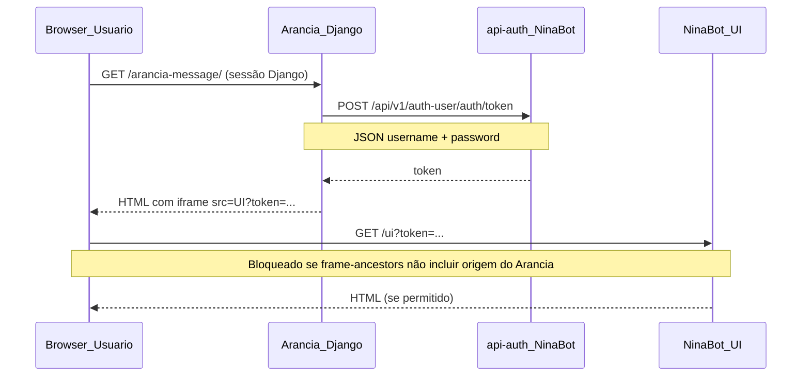

# Spec — Embed do NinaBot no Arancia (iframe + SSO por token)

**Como usar:** envie este arquivo ao time do **NinaBot**. Eles podem colar a seção [Prompt para colar no Cursor](#prompt-para-colar-no-cursor) no repositório do NinaBot.

**De:** Time Arancia (Django BFF)  
**Para:** Time NinaBot (UI + api-auth)  
**Data:** 24/06/2026  
**Status:** Bloqueio de iframe em homolog — auth por token OK

---

## 1. Resumo executivo

O **Arancia** (plataforma Django C-Trends) passou a integrar o **Arancia Message** (NinaBot) embutido em **iframe**, na rota:

| Ambiente | Rota Django |
|----------|-------------|
| Homolog | `http://192.168.0.216/hg-arancia/arancia-message/` |
| Produção | `https://www.centralretencao.com.br/arancia/arancia-message/` |

Fluxo já implementado no Arancia:

1. Usuário logado no Arancia acessa a tela.
2. O BFF Django chama a API de auth do NinaBot com `username` + `password` do usuário.
3. Recebe um **token**.
4. Monta a URL do iframe: `{NINABOT_UI_URL}?token={token}`.

**Problema atual:** o iframe **não carrega em homolog** (`http://192.168.0.216`). O navegador exibe ícone de página quebrada.

**Causa confirmada:** o NinaBot responde com CSP restritivo:

```http
Content-Security-Policy: frame-ancestors 'self' https://www.centralretencao.com.br
```

Origens como `http://192.168.0.216` **não estão liberadas** para embed.

**O que precisamos do NinaBot:** ampliar `frame-ancestors` (e manter estável o fluxo de token na UI).

---

## 2. Fluxo de integração (como está hoje)



### 2.1 API de autenticação (já consumida pelo Arancia)

| Item | Valor |
|------|-------|
| **URL (homolog)** | `http://192.168.0.216/api-auth/api/v1/auth-user/auth/token` |
| **Método** | `POST` |
| **Content-Type** | `application/json` |
| **Body** | `{"username": "<usuario_arancia>", "password": "<senha_arancia>"}` |

**Resposta esperada (sucesso):** JSON contendo o token em um destes campos (o Arancia aceita qualquer um):

- `token`
- `access_token`
- `auth_token`
- `data.token` (objeto aninhado)

**Resposta de erro observada:** HTTP 404 com `{"detail": "Credenciais inválidas (...)"}` para usuário/senha incorretos.

### 2.2 URL da UI (iframe)

| Item | Valor (homolog atual) |
|------|------------------------|
| **Base** | `https://ninabot-ninabot.jk5mhc.easypanel.host/ui` |
| **Query string** | `?token=<token_retornado_pela_api>` |
| **Exemplo** | `https://ninabot-ninabot.jk5mhc.easypanel.host/ui?token=eyJ...` |

Scripts já presentes no HTML da UI (observados no homolog):

- `/ui/static/att-auth.js`
- `/ui/static/sso-bootstrap.js`

Presumimos que o token na query string é consumido por esses scripts para autenticar a sessão da UI **sem tela de login manual**.

---

## 3. Requisito principal — liberar iframe (CSP)

### 3.1 Comportamento atual

```http
GET https://ninabot-ninabot.jk5mhc.easypanel.host/ui?token=...
→ Content-Security-Policy: frame-ancestors 'self' https://www.centralretencao.com.br
```

| Origem do Arancia (parent do iframe) | Embed permitido hoje? |
|--------------------------------------|------------------------|
| `https://www.centralretencao.com.br` | Sim |
| `http://192.168.0.216` (homolog) | **Não** |
| `http://192.168.0.214` | **Não** |
| `http://192.168.0.215` | **Não** |
| `http://127.0.0.1` / `http://localhost` (dev local) | **Não** |

### 3.2 Comportamento desejado

Incluir no header `Content-Security-Policy` da **UI** (`/ui`, `/ui/*`, assets se aplicável) as origens abaixo em `frame-ancestors`:

**Obrigatório (produção):**

```
https://www.centralretencao.com.br
```

**Obrigatório (homolog / rede interna):**

```
http://192.168.0.216
http://192.168.0.214
http://192.168.0.215
```

**Recomendado (desenvolvimento local):**

```
http://127.0.0.1
http://localhost
```

**Exemplo de header final (homolog):**

```http
Content-Security-Policy: frame-ancestors 'self' https://www.centralretencao.com.br http://192.168.0.216 http://192.168.0.214 http://192.168.0.215 http://127.0.0.1 http://localhost
```

### 3.3 Implementação sugerida no NinaBot

- Tornar a lista de ancestors **configurável por ambiente** (env var), por exemplo:
  - `NINABOT_FRAME_ANCESTORS='self' https://www.centralretencao.com.br http://192.168.0.216 ...`
- Aplicar o header em todas as respostas HTML da UI que podem ser carregadas no iframe (`/ui`, redirects pós-login SSO, etc.).
- **Não** usar `X-Frame-Options: DENY` ou `SAMEORIGIN` em conflito com o CSP desejado.
- Se existir middleware de segurança global, garantir que rotas `/ui` recebam o CSP correto.

### 3.4 O que NÃO é necessário alterar (salvo bug)

- Contrato da API `POST .../auth/token` — já funciona com `username` / `password`.
- Formato `?token=` na URL — já é o que o Arancia envia.
- CORS para chamadas API a partir da UI embutida — escopo separado; o bloqueio atual é **somente** `frame-ancestors`.

---

## 4. Requisitos de SSO / token na UI

| # | Requisito | Detalhe |
|---|-----------|---------|
| R1 | Token na query | `GET /ui?token=<jwt_ou_token>` deve autenticar o usuário sem exigir login manual |
| R2 | Token inválido/expirado | Exibir mensagem clara na UI (não página em branco) |
| R3 | Token válido em iframe | Após auth, manter navegação interna com paths relativos `/ui/...` |
| R4 | Cookies / sessão | Se usar cookies, definir `SameSite` compatível com iframe cross-site quando parent for `centralretencao.com.br` e UI em outro domínio (`easypanel.host`) |
| R5 | Logout | Opcional: link para voltar ao Arancia ou invalidar sessão NinaBot ao sair |

**Atenção cross-origin:** o parent (Arancia) e a UI (NinaBot) estão em **domínios diferentes**. Se a autenticação depender só de cookie `HttpOnly` sem propagar o token, validar comportamento **dentro do iframe**, não apenas em aba direta.

---

## 5. Origens e URLs de referência (Arancia)

| Ambiente | Base path | Host típico |
|----------|-----------|-------------|
| Homolog | `/hg-arancia/` | `http://192.168.0.216` |
| Produção | `/arancia/` | `https://www.centralretencao.com.br` |

Configuração no Arancia (`setup/environments.py`):

```python
'arancia_message_auth_token_url': 'http://192.168.0.216/api-auth/api/v1/auth-user/auth/token',
'arancia_message_ui_url': 'https://ninabot-ninabot.jk5mhc.easypanel.host/ui',
'arancia_message_frame_ancestors': [
    'https://www.centralretencao.com.br',
    # homolog será adicionado aqui após deploy no NinaBot
],
```

Após o NinaBot liberar homolog, o Arancia atualizará `arancia_message_frame_ancestors` para incluir `http://192.168.0.216`.

---

## 6. Critérios de aceite

### 6.1 CSP / iframe

- [ ] Acessar `http://192.168.0.216/hg-arancia/arancia-message/` com usuário Arancia válido → iframe exibe o painel NinaBot (sem ícone de erro do browser).
- [ ] Acessar `https://www.centralretencao.com.br/arancia/arancia-message/` → iframe continua funcionando.
- [ ] DevTools → Network → documento `/ui?token=...` → header `Content-Security-Policy` inclui a origem do parent.
- [ ] Nenhum `X-Frame-Options` bloqueando embed nas rotas da UI.

### 6.2 Auth por token

- [ ] `POST .../auth/token` com credenciais válidas retorna token em JSON.
- [ ] `GET /ui?token=<válido>` autentica sem tela de login.
- [ ] `GET /ui?token=invalido` retorna UX de erro compreensível.

### 6.3 Regressão

- [ ] Abrir `https://ninabot-.../ui?token=...` **diretamente em nova aba** continua funcionando.
- [ ] Usuário sem permissão no Arancia não chega à tela (lado Arancia — apenas smoke test).

---

## 7. Como validar (comandos úteis)

### Verificar CSP atual

```bash
curl -s -D - -o /dev/null "https://ninabot-ninabot.jk5mhc.easypanel.host/ui?token=test" | grep -i content-security-policy
```

### Testar auth (substituir credenciais reais)

```bash
curl -s -X POST "http://192.168.0.216/api-auth/api/v1/auth-user/auth/token" \
  -H "Content-Type: application/json" \
  -d '{"username":"USUARIO","password":"SENHA"}'
```

### Teste manual no browser

1. Login no Arancia homolog.
2. Abrir `/hg-arancia/arancia-message/`.
3. Confirmar painel NinaBot dentro do layout (navbar + sidebar Arancia visíveis).

---

## 8. Fora de escopo (neste pedido)

- Alterações no código Django do Arancia (já implementado).
- Proxy reverso no Arancia para contornar CSP (não desejado).
- Novos campos na API de auth além de `username` / `password`.
- Permissões de módulo no Arancia (`logistica.acesso_arancia`).

---

## Prompt para colar no Cursor

Copie o bloco abaixo no repositório do **NinaBot**:

```markdown
## Tarefa: liberar embed da UI NinaBot no Arancia (iframe + SSO por token)

### Contexto
O sistema **Arancia** (Django) embute a UI do NinaBot em um iframe na rota `/arancia-message/`.
O Arancia já obtém token via:
`POST http://192.168.0.216/api-auth/api/v1/auth-user/auth/token`
com body JSON `{"username","password"}` e abre:
`https://ninabot-ninabot.jk5mhc.easypanel.host/ui?token=<token>`.

### Problema
O iframe não carrega em homolog porque a UI responde com:
`Content-Security-Policy: frame-ancestors 'self' https://www.centralretencao.com.br`
O Arancia homolog roda em `http://192.168.0.216` — origem não permitida.

### O que implementar
1. Tornar `frame-ancestors` configurável por ambiente (env var).
2. Incluir no CSP da UI (`/ui`, `/ui/*`):
   - `https://www.centralretencao.com.br` (prod)
   - `http://192.168.0.216` (homolog)
   - `http://192.168.0.214`, `http://192.168.0.215` (rede interna)
   - opcional: `http://127.0.0.1`, `http://localhost`
3. Remover/evitar `X-Frame-Options: DENY|SAMEORIGIN` conflitante nas rotas da UI.
4. Garantir que `GET /ui?token=...` autentica via `sso-bootstrap.js` / `att-auth.js` **dentro de iframe** (parent cross-origin).
5. Token inválido: mensagem de erro amigável, não página em branco.

### Critérios de aceite
- iframe em `http://192.168.0.216/hg-arancia/arancia-message/` exibe o painel após login Arancia.
- iframe em `https://www.centralretencao.com.br/arancia/arancia-message/` continua OK.
- Abrir a mesma URL com token em nova aba continua funcionando.
- `curl -s -D - -o /dev/null "https://.../ui?token=x" | grep -i frame-ancestors` lista as origens acima.

### Referência completa
Ver spec: `ninabot-arancia-iframe-embed-spec.md` (repositório Arancia, pasta `docs/`).
```

---

## 9. Contato / dúvidas

- Integração implementada no Arancia: `logistica/services/arancia_message_service.py`, view `arancia_message_iframe`, template `templates_arancia_message/arancia_message_iframe.html`.
- Em caso de mudança de URL da UI homolog/prod, avisar o time Arancia para atualizar `setup/environments.py`.
