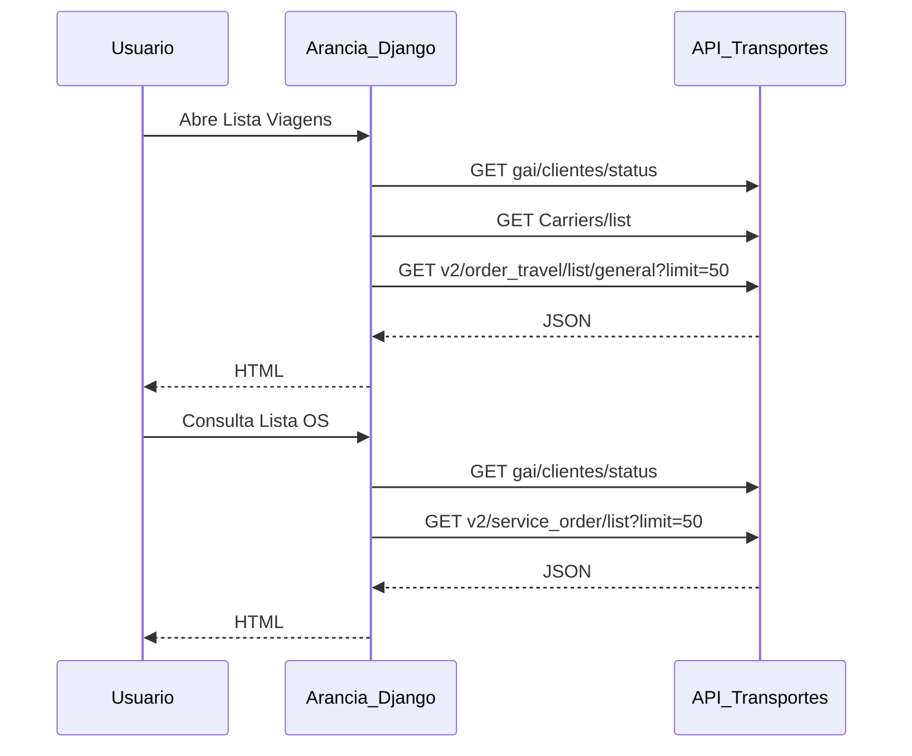

# Spec de performance — APIs de Transportes (Arancia)

Documento para envio ao **time de API de Transportes**. Descreve consumo, gargalos suspeitos, contratos esperados e SLAs de latência alinhados entre BFF Django e API.

**De:** Time Arancia (Django BFF)  
**Para:** Time API de Transportes  
**Data:** 24/06/2026  
**Contexto:** Telas **Lista de Viagens** e **Lista de OS** apresentam travamentos. O consumidor já foi otimizado (cache de metadados, `limit=50`, lazy-load de modais). Precisamos validar gargalos na API e fechar SLAs.

**Documentos relacionados:**

- Plano interno de otimização: `.cursor/plans/otimizar_listas_transportes_fd546ae0.plan.md`
- Regras de negócio transportes: `.cursor/rules/203-business-transportes-auto.mdc`

---

## 1. Resumo executivo

O Arancia **não persiste** OS/viagens localmente — todas as listagens vêm de `TRANSP_API_URL` (configurado em `setup/local_settings.py`). Cada interação do usuário dispara **1 a 3 chamadas HTTP síncronas** antes de renderizar HTML.



| Achado | Implicação |
|--------|------------|
| Dados operacionais vêm 100% da API | Gargalo de listagem não se resolve só no Django |
| Lista Viagens: 3 APIs na 1ª abertura | Metadados + listagem; após cache BFF, resta 1 call |
| Lista OS: metadados em todo request | `gai/clientes/status` bloqueia mesmo sem consulta |
| Page size acordado | **`limit=50`** em ambas as listas |
| Timeout do BFF (listagens) | **30 s** (`LIST_API_TIMEOUT`) |

**Hipótese principal:** lentidão está na **API de listagem** (tempo de query + tamanho do payload), não no Django ORM.

### O que já foi feito no BFF (para contexto)

| Otimização | Onde |
|------------|------|
| Cache Django de metadados (TTL 10 min) | `transportes/utils/metadata_api.py` |
| Metadados em paralelo | `get_transportes_metadata()` |
| Paginação `offset`/`limit=50` | `lista_viagens_service.py`, `consulta_os_service.py` |
| Lazy-load de viagens/eventos em modais | `api_listas_transportes.py` |
| Instrumentação por fase | `transportes/instrumentation.py`, `PERFORMANCE_INSTRUMENTATION` |
| Probe de baseline | `python manage.py measure_transportes_baseline` |

---

## 2. Telas consumidoras

| UI (menu) | Rota Django | View | Service |
|-----------|-------------|------|---------|
| Lista Viagens | `transportes:lista_viagens` | `view_lista_viagens.py` | `lista_viagens_service.py` |
| Lista de OS | `transportes:consulta_os_transp` | `view_consulta_os_transp.py` | `consulta_os_service.py` |

---

## 3. Endpoints consumidos

### 3.1 Metadados (alta frequência)

| Endpoint | Método | Quando é chamado | Cache no BFF |
|----------|--------|------------------|--------------|
| `/gai/clientes/status?cliente=arancia_client` | GET | Toda abertura de Lista OS; Lista Viagens (1ª vez ou após TTL) | Sim, 10 min |
| `/Carriers/list` | GET | Lista Viagens (filtro transportadora) | Sim, 10 min |

**Pergunta para API:** existe possibilidade de um endpoint unificado de metadados (clientes + tipos + status + carriers) para reduzir round-trips?

---

### 3.2 Listagem — Lista de Viagens

| Endpoint | Método |
|----------|--------|
| `/v2/order_travel/list/general` | GET |

**Parâmetros que o BFF envia hoje** (`build_api_params` em `lista_viagens_service.py`):

| Param API | Origem no filtro | Observação |
|-----------|------------------|------------|
| `Response` | `resume` ou `detailed` | Default: `resume`. `detailed` inclui `travel_events` |
| `offset` | `(page - 1) * 50` | Crítico para performance |
| `limit` | `50` | Fixo (`PAGE_SIZE`) |
| `designation_id` | `pa_selecionada` | Obrigatório para usuários grupo `arancia_PA` |
| `order_type` | `tipo_servico` (IDs → `type`) | CSV |
| `status` | `status_list` (IDs → `type`) | CSV |
| `IN` / `EX` | `os_interna` / `os_externa` | |
| `travel_id`, `cliente`, `transportadora`, `driver_id` | direto | |
| `sem_motorista`, `atrasado`, `cep_origin`, `cep_destin`, `data_limite_entrega` | direto | |
| `created_at`, `driver_nome`, `status_id` | — | **Não enviados** (campos de UI apenas) |

**Comportamento do consumidor:**

- Carga automática na abertura com `Response=resume&offset=0&limit=50` (sem filtros adicionais, salvo PA forçada pelo GAI do usuário).
- Modo `detailed` quando usuário seleciona explicitamente; eventos também podem ser carregados via lazy-load (`travel_id` + `Response=detailed&limit=1`).
- Filtros persistidos em session para paginação (`lista_viagens_filtros`).

**Validação necessária da API:**

1. `offset`/`limit` são **honrados** (não retornar mais de 50 itens)?
2. Existe campo `total`, `count` ou `total_count` na resposta?
3. Páginas distintas retornam conjuntos de `travel.id` **sem sobreposição**?
4. Formato da resposta: `list` direto ou `{ items/results/data, total }`?

---

### 3.3 Listagem — Lista de OS

| Endpoint | Método |
|----------|--------|
| `/v2/service_order/list` | GET |

| Param API | Origem no filtro |
|-----------|------------------|
| `limit` | `50` |
| `offset` | `(page - 1) * 50` |
| `IN` / `EX` | número OS + tipo IN/EX |
| `cliente` | nome do cliente (resolvido via metadados) |
| `designation_id` | PA selecionada |
| `origin_id`, `destin_id` | origem/destino |
| `status`, `order_type` | CSV de `type` (não ID) |
| `data_inicial`, `data_final`, `created_at` | filtros de data |

**Comportamento:** listagem só dispara com `enviar_evento=1` (consulta explícita ou filtro favorito aplicado). Metadados disparam sempre.

**Validação:** confirmar que `total`/`count` retornado é confiável para paginação.

---

### 3.4 Lazy-load (sob demanda)

| Endpoint | Quando | SLA alvo (p95) |
|----------|--------|----------------|
| `/service_orders/{order_number}` | Modal "viagens da OS" | ≤ 1 s |
| `/v2/order_travel/list/general?travel_id=X&Response=detailed&limit=1` | Modal eventos da viagem | ≤ 1 s |

---

### 3.5 Export (fora do SLA de tela)

| Endpoint | Uso |
|----------|-----|
| `/service_orders/export/excel` | Export Lista OS |
| `/v2/order_travel/export/general/excel` | Export Lista Viagens |

Aceitável até **30 s**; idealmente assíncrono (job + link de download).

---

## 4. Fan-out por tela e orçamento de latência

### 4.1 Orçamento ponta a ponta (usuário → HTML renderizado)

| Cenário | Chamadas API | Orçamento p95 total | Observação |
|---------|--------------|---------------------|------------|
| Abrir Lista Viagens (1ª vez) | 3 (status + carriers + list) | **≤ 3,0 s** | Após cache BFF: 1 call |
| Abrir Lista Viagens (cache hit) | 1 (list) | **≤ 2,0 s** | |
| Trocar página Lista Viagens | 1 (list) | **≤ 1,5 s** | |
| Abrir Lista OS (sem consulta) | 1 (status) | **≤ 1,0 s** | Só filtros |
| Consultar Lista OS (página 1) | 2 (status + list) | **≤ 2,5 s** | Com cache metadados: ≤ 2,0 s |
| Trocar página Lista OS | 1 (list) | **≤ 1,5 s** | |
| Abrir modal viagens/eventos | 1 | **≤ 1,0 s** | |

### 4.2 SLA por endpoint (API isolada, p95)

| Tier | Endpoint | p95 alvo | p99 máximo | Situação atual |
|------|----------|----------|------------|----------------|
| **P0** | `v2/order_travel/list/general` sem paginação efetiva | — | — | **Bloqueante** se retorna dataset completo |
| **P0** | `v2/order_travel/list/general` com `limit=50` | **≤ 2,0 s** | 5 s | A medir |
| **P0** | `v2/service_order/list` com `limit=50` | **≤ 2,0 s** | 5 s | A medir |
| **P1** | `gai/clientes/status` | **≤ 500 ms** | 1 s | Chamado em quase todo request |
| **P1** | `Carriers/list` | **≤ 500 ms** | 1 s | |
| **P2** | `service_orders/{order_number}` | **≤ 1,0 s** | 2 s | Modal lazy-load |
| **P3** | Exports Excel | **≤ 30 s** | 60 s | Ou async |

### 4.3 Limites operacionais acordados

| Item | Valor |
|------|-------|
| Page size (`limit`) | **50** (fixo nas duas listas) |
| Timeout do consumidor (listagens) | **30 s** |
| Timeout legado (`RequestClient` default) | 100 s |
| Cache metadados no BFF | 10 min (não substitui SLA da API) |

---

## 5. Contrato de resposta esperado (paginação)

Para **ambos** os endpoints de listagem, o BFF precisa de:

```json
{
  "items": [],
  "total": 1234
}
```

Campos aceitos para lista: `items` > `results` > `data`.  
Campos aceitos para total: `total` > `count` > `total_count`.

**Se `total` não existir:** o BFF usa heurística `has_next = (len(items) == limit)` — funciona, mas a paginação fica imprecisa (sem "página X de Y" confiável).

| Requisito | `v2/service_order/list` | `v2/order_travel/list/general` |
|-----------|-------------------------|----------------------------------|
| Honra `offset` + `limit` | Confirmar | **Validar** |
| Retorna `total` | Confirmar | **Validar** |
| `Response=resume` sem nested pesado | N/A | Eventos omitidos ou só contagem |
| IDs estáveis entre páginas | Sim | Sim |

---

## 6. Payload e campos por modo

### `Response=resume` (default — listagem)

**Incluir (mínimo para cards/tabela):**

- `travel`: id, datas, status, motorista, transportadora
- `service_order`: order_number, order_type, client, direction
- Contagem de eventos (`travel_events_count` ou array vazio)

**Não incluir em listagem:**

- Array completo `travel_events` com histórico detalhado
- Objetos aninhados não usados na listagem (avaliar projeção/`fields`)

### `Response=detailed` (modal / drill-down)

- Eventos completos **apenas** para o `travel_id` solicitado
- Evitar retornar `detailed` para consultas amplas com `limit=50` sem `travel_id`

---

## 7. Cenários de teste (reprodução pelo time de API)

Pedimos medição de **p50 / p95 / p99** e **tamanho do JSON (KB)** em ambiente representativo (ex.: 5k+ viagens ativas, 10k+ OS).

| # | Cenário | Request exemplo |
|---|---------|-----------------|
| T1 | Viagens — abertura padrão | `GET .../v2/order_travel/list/general?Response=resume&offset=0&limit=50` |
| T2 | Viagens — página 2 | `...&offset=50&limit=50` |
| T3 | Viagens — PA específica | `...&designation_id={id}&offset=0&limit=50` |
| T4 | Viagens — filtros combinados | cliente + status + período |
| T5 | Viagens — sem limit (baseline legado) | `?Response=resume` (sem offset/limit) — **quantificar problema** |
| T6 | OS — consulta ampla | `GET .../v2/service_order/list?limit=50&offset=0` |
| T7 | OS — com filtros | PA + datas + status |
| T8 | Metadados | `GET .../gai/clientes/status?cliente=arancia_client` |
| T9 | Carriers | `GET .../Carriers/list` |
| T10 | Lazy modal OS | `GET .../service_orders/{order_number}` |
| T11 | Lazy eventos | `GET .../v2/order_travel/list/general?travel_id=X&Response=detailed&limit=1` |

**Template de resposta esperada do time de API:**

| Cenário | p50 (ms) | p95 (ms) | p99 (ms) | Itens retornados | Payload (KB) | Observações |
|---------|----------|----------|----------|------------------|--------------|-------------|
| T1 | | | | | | |
| T2 | | | | | | |
| … | | | | | | |

---

## 8. Como medir do lado Arancia

### 8.1 Comando de baseline

```bash
# APIs diretas + validação de paginação order_travel/list
python manage.py measure_transportes_baseline --repeat 5

# Views Django (requer usuário com transportes.ver_transportes)
python manage.py measure_transportes_baseline \
  --username ARC_SEU_USUARIO \
  --password SUA_SENHA \
  --repeat 3
```

Saída esperada:

- Tabela com tempos de `clientes_status`, `carriers_list`, `order_travel_full`, `order_travel_p50`
- Seção **Validação paginação order_travel/list**: `offset/limit OK`, campo `total`, contagem por página

### 8.2 Instrumentação em desenvolvimento

Em `setup/local_settings.py`:

```python
PERFORMANCE_INSTRUMENTATION = True
```

Logs no runserver: `TRANS_PERF` com fase (`metadata`, `order_travel_list`, `clientes_status`, `service_order_list`), tempo em ms e quantidade de itens.

Headers de resposta (quando middleware ativo): `X-Request-Time-Ms`, `X-Transp-HTTP-Calls`, `X-Transp-HTTP-Time-Ms`.

### 8.3 Probe de paginação (código)

`transportes/utils/baseline.py` — função `probe_order_travel_pagination()`:

- Compara página `offset=0` vs `offset=50` com `limit=50`
- Verifica IDs distintos entre páginas
- Alerta se API retorna mais itens que `limit`

**Pedido ao time de API:** compartilhar métricas equivalentes (APM, logs de request duration) para T1–T11, com data/hora e ambiente.

---

## 9. Perguntas abertas (checklist de resposta)

| # | Pergunta | Resposta API |
|---|----------|--------------|
| 1 | `order_travel/list/general` honra `offset`/`limit`? Comportamento quando omitidos? | |
| 2 | Qual campo de total a API retorna? Calculado antes ou depois dos filtros? | |
| 3 | Existe índice em `designation_id`, `status`, `created_at`, `data_limite_entrega`? | |
| 4 | Tempo e volume de T5 (sem paginação)? Quantos registros retorna? | |
| 5 | `Response=resume` pode omitir `travel_events` completamente? | |
| 6 | `gai/clientes/status` pode expor `Cache-Control` / `ETag`? | |
| 7 | Há plano para endpoint de metadados unificado? | |
| 8 | Exports podem ser assíncronos? | |
| 9 | Há rate limit que explique timeouts em pico? | |
| 10 | Homologação espelha produção em volume de dados? | |

---

## 10. Critérios de aceite (fechamento do ticket API)

- [ ] T1 e T6 com **p95 ≤ 2 s** em ambiente representativo
- [ ] T8 e T9 com **p95 ≤ 500 ms**
- [ ] Paginação de viagens validada (`offset`/`limit` + `total`)
- [ ] T5 documentado com plano de deprecação ou bloqueio de consulta sem `limit`
- [ ] `Response=resume` não inclui payload completo de eventos na listagem
- [ ] Métricas T1–T11 preenchidas e compartilhadas (planilha ou dashboard)

---

## 11. Referências no repositório Arancia

| Artefato | Caminho |
|----------|---------|
| Service Lista Viagens | `transportes/services/lista_viagens_service.py` |
| Service Lista OS | `transportes/services/consulta_os_service.py` |
| Metadados + cache | `transportes/utils/metadata_api.py` |
| Probe / baseline | `transportes/utils/baseline.py` |
| Comando de medição | `transportes/management/commands/measure_transportes_baseline.py` |
| HTTP client | `utils/request.py` (`RequestClient`, timeout default 100 s) |
| Lazy-load JSON | `transportes/views/views_transportes/api_listas_transportes.py` |

---

## Histórico

| Data | Alteração |
|------|-----------|
| 24/06/2026 | Versão inicial — spec para alinhamento com time de API |
